# LET'S TEST YOU!

This is a **quiz on general knowledge** website that enable the users to test themselves on 8 different topics: History, Geography, Geopolitics, Economy, Nature, English and Psychology. The user can replay he game and have other questions displayed. It will be useful for the user to test his general knowledge or even learn.

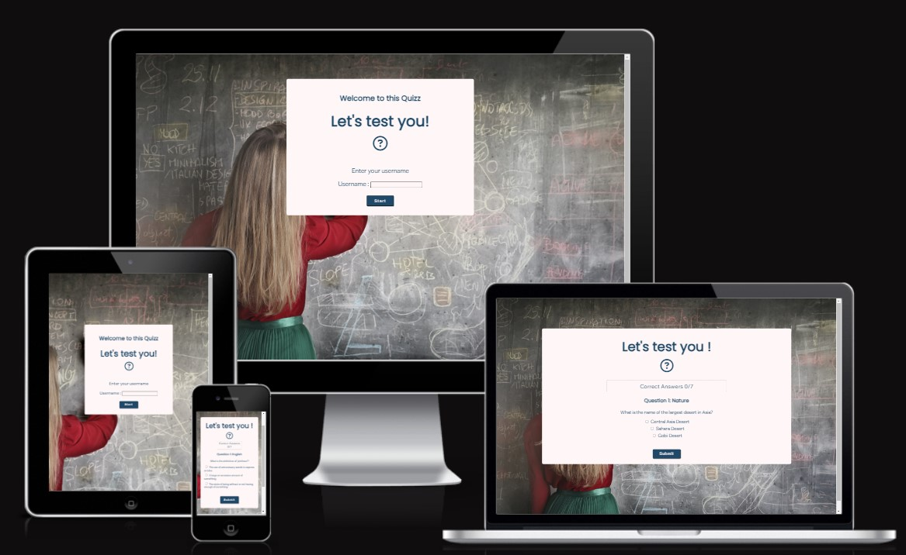

Project URL : [Let's Test You!](https://shiimymy.github.io/general-knowledge-quizz/)

## Features

### Landing Page 

The landing page is the index.html that the user will see which has different components.

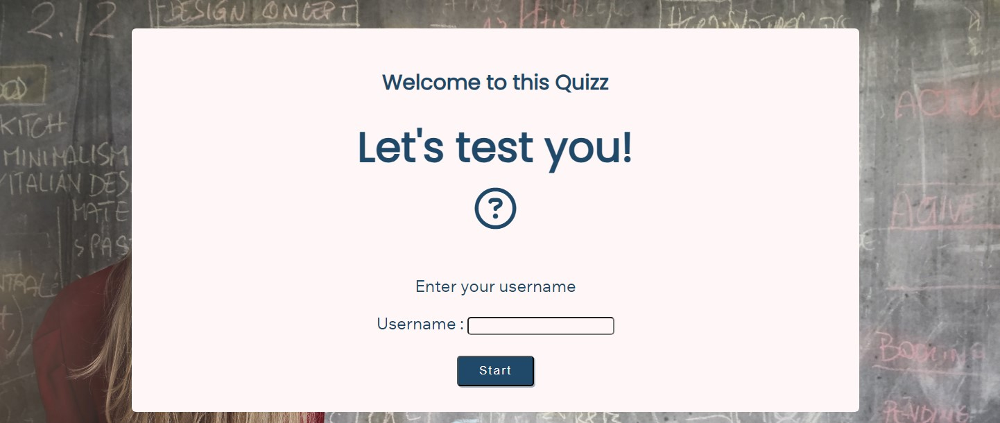

#### Description

The description can be found on all html pages by hovering the mouse on the question mark icon. This will allow to make the user aware of the number subjects and that he can replay the game to have other questions.

#### Username Form

The user form can be found on the first page that will ask the player to choose an username. This username will then be displayed on the second page of the website.

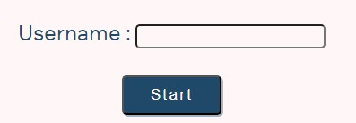

### The quiz page

#### Score 

The score area show the number of questions *(which is 7)* that one round will display. It will also count the number of correct answers each time an answer is submitted. If the answer is correct, it will add one point to the score.

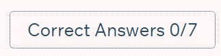

#### Question number 

The question number is actually very useful as this what the game will check to know if whether or not the game needs to end. The game will indeed display 7 questions per round.

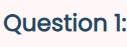

#### Question content

The question content will be chosen randomly by the system between the 14 possibilities. It is divided in 3 elements that stay connected: the subject, the actual question and 3 different answer options.

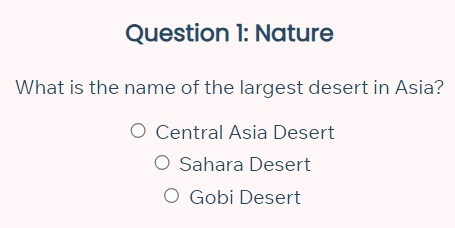

#### Submit button

The submit button as different roles: 
* Display the next question once the answer has been selected and the user click it,
* Add a point to the score if the answer is correct,
* And check if the maximum of questions, during the round, has been reach to end quiz.

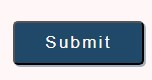

#### End Message

The end message will be display once the 7 questions have been answered whereas the question area will be hidden. The user will then easily understand that the round is over and a little feedback will show. This feedback will change depending of the score of the round. 

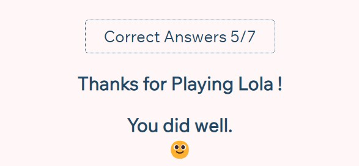

#### End buttons

With the End message, two buttons will be displayed. The user will have the choice to either restart the game from the question or exit the game totally.

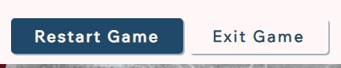

## Testing

### Manual Testing

| Test | Expected result | Passed |
| ---- | ---- | --- |
| Cross Browser Testing | The Website is working on Google Chrome, Microsoft Edge, and Firefox. | YES |
| Page loading | The pages load correctly with content at the right position | YES |
| Username Form | The form can't be subimited without an username and redirect to quizz.html | YES |
| Question mark icon | When the icon is hover, the description appear and disappear when mouse leave | YES |
| Username display | The username enter in the first form is displayed in the h1 of quizz.html | YES |
| Answer submition | Only one answer can be selected and submit at a time | YES |
| Answer display | Once the answer is submited, a message appear to let know if the answer is correct | YES |
| Point add | When the answer is correct, a point is added to the score | YES |
| Next Question button | This button appears with the answer and when clicked a new question is displayed | YES |
| Random Question | The new Question is a random question taken from the array with no repeat | YES |
| Round stop | A round is 7 questions only | YES |
| Thanks User | The thanks message is customized with username | YES |
| Feedback display | A different feedback is displayed depending on the score | YES |
| Resart Game | The button restart game start a new round | YES |
| Exit Game | The Exit Game button redirect the user to www.google.com | YES |

### Validator Testing

* HTML Testing : 1 error found with [W3C Validator](https://validator.w3.org/) in the text input of the first page as I used "min" attribute which in now deleted.
* CSS Testing : 1 error found with [Jigsaw Validator](https://jigsaw.w3.org/css-validator/validator) as I used "none" instead of an actual color as a value after a color property. It is now changed.

### Performance Testing

I used [Lighthouse](https://developer.chrome.com/docs/lighthouse/overview/) to test the performances of my 2 pages. The results were positive, as scores were between 90 and 93. Please find the result below at the time of the tests :

* Index page performances :

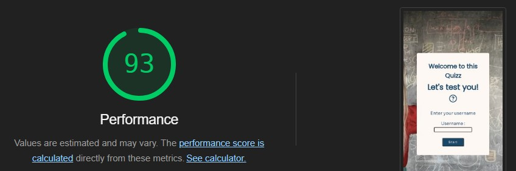

* Quiz page performances : 

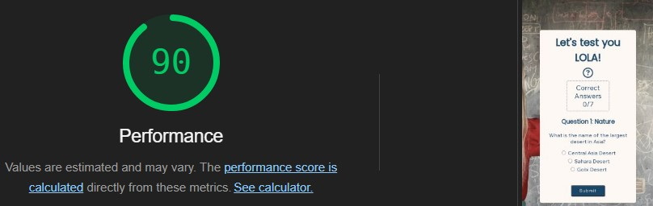

### Fixed issues 

| Issues | Description | Steps done to fix |
| --- | ---- | ---- |
| Responsivness | Website not responsive on big screens | Changes done thanks to [Am I Responsive website](https://ui.dev/amiresponsive) as I didn't have acess to a bigger screen. |
| Exit Game | Exit Game button giving 404 error | Delete function and add href in the link to redirect user |
| User experience | User didn't know the correct answer when choosing a wrong option | Add message when answer is submitted |
| Score color | The content was transparent | Update color in css to make the content visible |

## Deployment

* **Fork template** : The first step before coding was to fork the [ci-full-template](https://github.com/Code-Institute-Org/ci-full-template) from [Code Institute](https://codeinstitute.net/ie/) as asked. 
To do so, once on the ci-full-template in Github (as per the first link), I clicked on **Fork** on the top-right of the page. Then I renamed the repository with the name of my project under **Repository name** and clicked to **Create Fork**. This allowed me to update the template.

* **Project deployment** : Once the site was nearly ready, it was deployed thanks to [Github](https://github.com/) from the [general-knowledge-quizz repository](https://github.com/Shiimymy/general-knowledge-quizz). Once in the repository, I clicked on **Settings** in the top navigation bar, then on Pages in the left menu. Once the page opened, in the Branch section, I chose main in the drop down menu and clicked on **Save**.

* **Clone project** :

This project will be also cloned to work localy on the future realesed by following these setps :

1. Go in [General Knowledge Quizz](https://github.com/Shiimymy/general-knowledge-quizz) repository,
2. Click on Code to find the URL and copy it.
3. In the Terminal write git clone and paste the url.
4. Press Enter to create the clone.

## Credit

### Content

* The question mark icon was taken from [Font Awesome](https://fontawesome.com/),
* The understanding of how a basic quiz using JS is build was found on [Geeks for Geeks](https://www.geeksforgeeks.org/),
* Instructions to know how to use the localStorage property were taken from [MDN](https://developer.mozilla.org/), 
* The instructions to add points to score were founds on [Love Maths Project](https://github.com/Code-Institute-Solutions/love-maths-2.0-sourcecode/tree/master).

### Media

The [Background image](https://www.pexels.com/fr-fr/photo/femme-en-rouge-a-manches-longues-ecrit-sur-tableau-noir-3769714/) has been taken from [Pexels](https://www.pexels.com/).

The images in the feedback have been take from [Pexels](https://www.pexels.com/) too : 
* [Bad score](https://www.pexels.com/fr-fr/photo/femme-melancolique-regarder-une-video-sur-un-ordinateur-portable-a-la-maison-3808012/),
* [Good Score](https://www.pexels.com/fr-fr/photo/personne-faisant-les-pouces-vers-le-haut-193821/),
* [Excellent Score](https://www.pexels.com/fr-fr/photo/photographie-de-personnes-diplomees-1205651/).